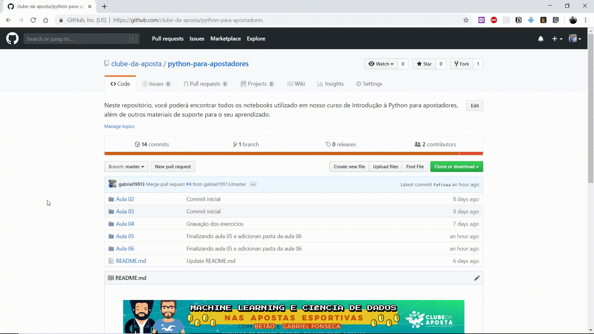

# Guia para download de arquivos no GitHub
Existem duas formas básicas que é fazendo o download do **repositório inteiro** e dos **arquivos individualmente**.

## Baixando o repositório por completo
Isso fará o download de todos os arquivos e pastas que estejam no repositório em um arquivo zipado. 
Portanto, você deve utilizar um programa como WinRar ou 7zip para descompactar os arquivos. 
Isso pode poupar tempo. No entanto, lembre-se que os repositórios no GitHub são mutáveis, e podem estar em constantes mudanças com 
novos arquivos. Assim, é importante se certificar de que você tem a última versão que foi inserida no repositório, ou se existe alguma 
modificação e que seja necessário realizar o download novamente.
Veja no GIF abaixo como baixar todos os arquivos do repositório simultaneamente:

## Baixando um arquivo único
Para baixa um único arquivo é também bem simples, basta acessar o arquivo, ir no botão raw, e clicar com o botão direito ou ctrl+s para salvar o arquivo.  **Atenção!!!** Recomento que você altere o nome do arquivo, e não se esqueça de selecionar a opção: Todos os arquivos, caso contrário é possível que seja salvo um arquivo em formato diferente daquele que você necessita. 
**OBs.:** É possível que em algumas situações quando o arquivo não é renderezido, apareça a opção de *Download*, assim você pode utilizá-la e evitar realizar todo esse processo. 
Veja o GIF abaixo para saber como baixar arquivos individualmente em um repositório GitHub:

